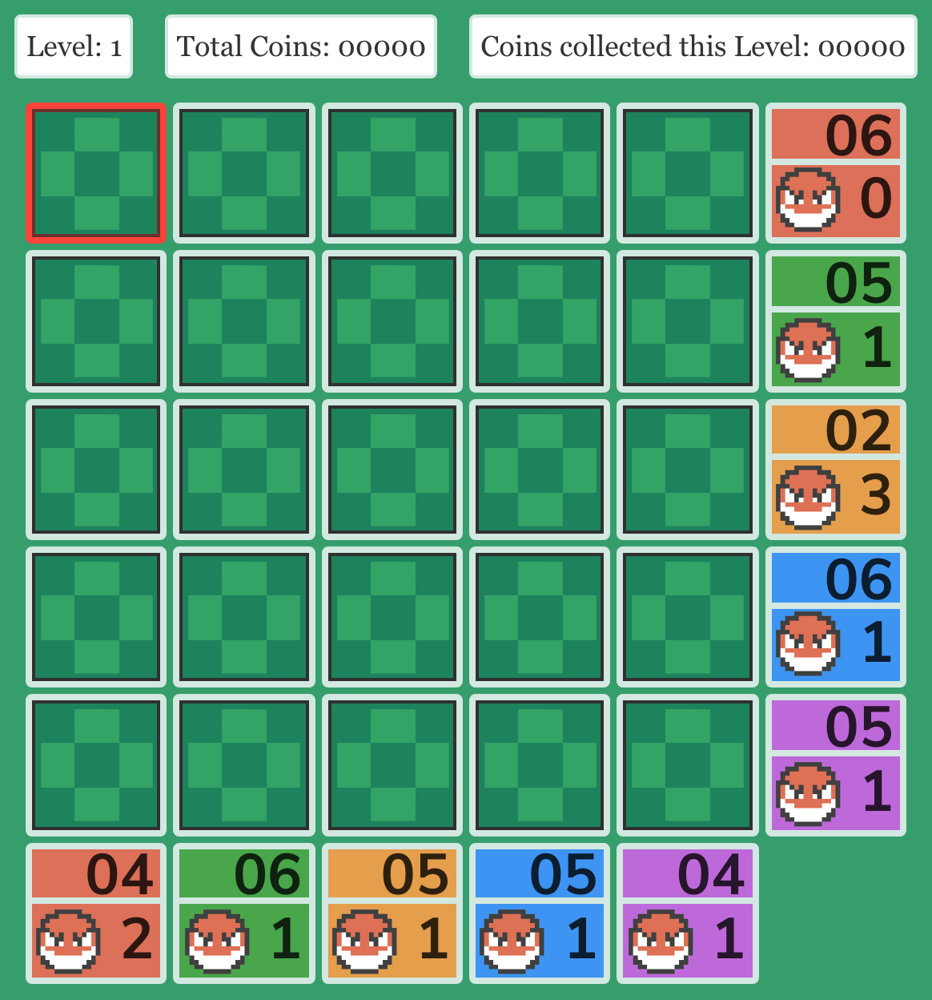
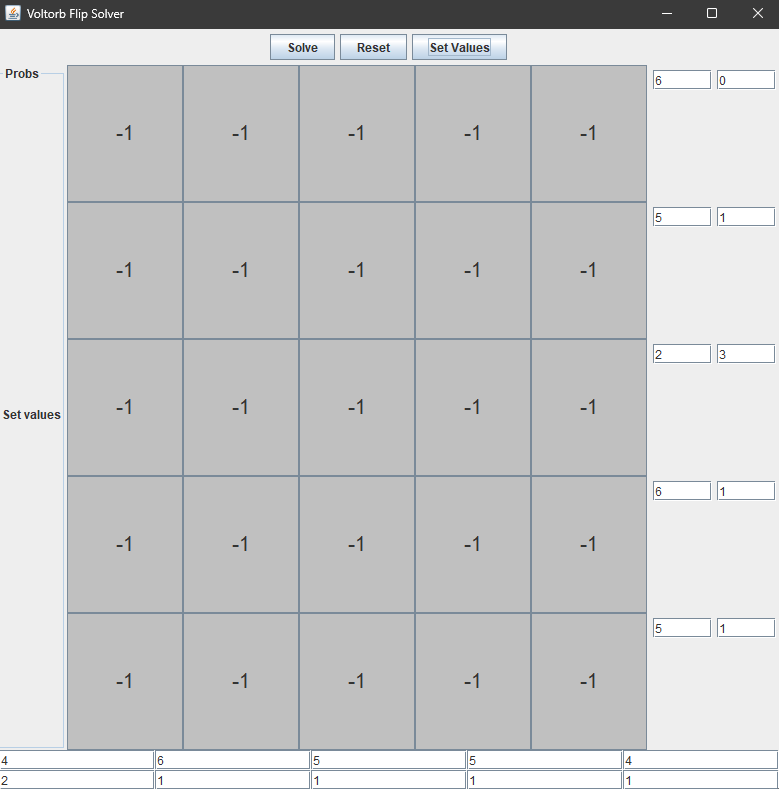
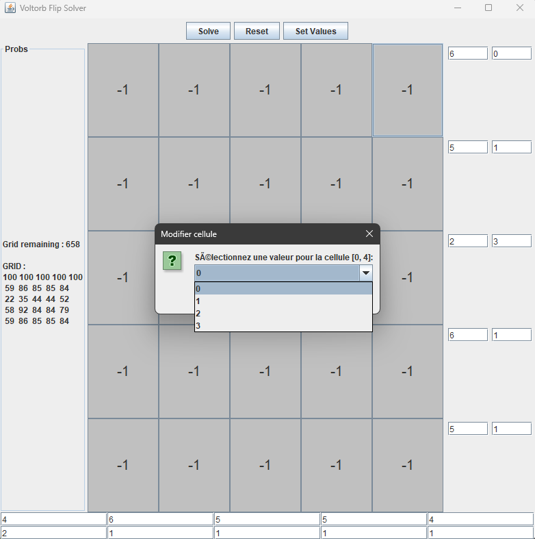

# VoltorbFlipSolver

Un solveur en Java pour le mini‑jeu **Voltorb Flip** (Pokémon HG/SS) qui calcule en temps réel les cases les plus sûres / rentables à retourner.

<p align="center">
  
</p>

---

## Fonctionnalités principales

| Fonction                     | Description                                                                                                          |
| ---------------------------- | -------------------------------------------------------------------------------------------------------------------- |
| Génération des possibilités  | Explore toutes les grilles compatibles avec les indices (somme des points et nombre de Voltorbes par ligne/colonne). |
| Calcul de probabilités       | Pour chaque case inconnue, estime la probabilité qu’elle contienne 0/1/2/3 ou un Voltorbe.                           |
| Interface CLI interactive    | Demande les coups joués et met à jour les probabilités en temps réel.                                                |
| Algorithme optimisé          | Back‑tracking + filtrage incrémental pour éviter l’explosion combinatoire.                                           |
| 100 % Java                   | Aucune dépendance externe ; se compile avec un JDK standard.                                                         |

> **Note :** Le projet est encore en développement mais complètement fonctionnel et utilisable. Les API et l’interface peuvent changer.

---

## Installation rapide

*Exemple pour un JDK 17 + sur Linux/Mac/Windows :*

```bash
# 1) Cloner le dépôt
$ git clone https://github.com/Fir3n0x/VoltorbFlipSolver.git
$ cd VoltorbFlipSolver

# 2) Compiler (tous les fichiers sont dans src/java)
$ javac java/*.java

# 3) Lancer
$ java VoltorbFlipUI
```

<details>
<summary> Via Docker (optionnel)</summary>

```bash
# Construction de l’image
$ docker build -t voltorb-solver .

# Lancement interactif
$ docker run -it voltorb-solver
```

</details>

---

## Utilisation (GUI)

Au lancement, le programme affiche une grille, il faut :
* Configurer les colonnes et les lignes avec les bonnes valeurs.
* Une fois configurer, il faut appuyer sur 'Set Values'.
* Ensuite, appuyer sur 'Solve'.

Il met ensuite à jour :

* la liste des grilles encore possibles ;
* le pourcentage qu’une case soit sûre ;
* la grille compacte à jouer (recommandations).

Exemple de sortie simplifiée :

```
PROBABILITÉS
  0.10 0.05 0.00 0.25 0.60
  0.05 0.05 0.05 0.45 0.40
  ...

Action conseillée → (ligne 0, col 4)
```


---

## Utilisation (CLI)

Au lancement, le programme affiche la grille « proba » et demande :

```
Quelle ligne ?  (0‑4)
Quelle colonne ? (0‑4)
Quelle valeur ?  (0,1,2,3)   # 0 = Voltorbe
```

Il met ensuite à jour :

* la liste des grilles encore possibles ;
* le pourcentage qu’une case soit sûre ;
* la grille compacte à jouer (recommandations).

Exemple de sortie simplifiée :

```
PROBABILITÉS
  0.10 0.05 0.00 0.25 0.60
  0.05 0.05 0.05 0.45 0.40
  ...

Action conseillée → (ligne 0, col 4)
```

---

## Captures d'écran

<p float="left">
  
  
</p>

---

## Contribuer

1. **Fork** le dépôt
2. Créez une branche (`git checkout -b feat/ma‑feature`)
3. Commitez vos changements (`git commit -am 'Ajout : ma feature'`)
4. Poussez la branche (`git push origin feat/ma‑feature`)
5. Ouvrez une **Pull Request**

Veuillez suivre le style de code existant (formatage IntelliJ par défaut) et ajouter des tests lorsque c’est pertinent.

---

## License

Ce projet est publié sous une licence MIT.

---

## Avertissement

Ce projet n’est affilié ni soutenu par Nintendo, The Pokémon Company, Game Freak ou Creatures Inc. « Pokémon ».

---

## English TL;DR

Java console solver for the Pokémon HG/SS mini‑game **Voltorb Flip**. Compile with `javac java/*.java`, run with `java Main`, then type the coordinates/value of each revealed tile to get live probabilities. Contributions welcome!

---

## Author

**Corentin Mahieu** – [@Fir3n0x](https://github.com/Fir3n0x)
